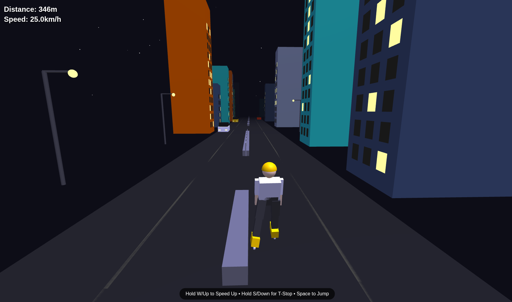

# [Street Inline Skates](https://ash-nix.github.io/Street-Inline-Skates/)
An Inline Skates HTML game

### [Play](https://ash-nix.github.io/Street-Inline-Skates/)

### How to play

Use "A" or "Left Arrow" key to go left
Use "D" or "Right Arrow" key to go right
Hold the "W" key to gain speed
Use the "S" key to stop
Use the "Space" key to jump

### Note
This project was created with the assistance of AI tools.
This was an experiment with Gemini.
